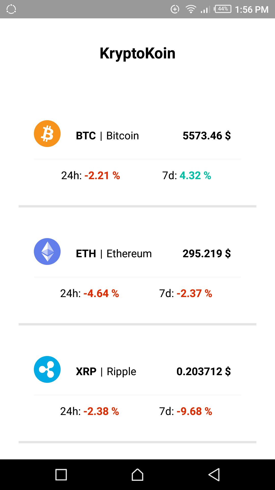

## KryptoKoin


React Native Crypto Currency application showcasing the top 10 cryptocurrencies.

### Requirements

First install the dependencies:

```bash
yarn install
or 
npm install
```
> depending on the Package manager you are using

To setup the project, you will need [Expo](https://expo.io/) app installed on your device or have the Android SDK installed and create an emulator, or if you are developing for IOS, you can create an emulator for IOS. The preferred method is to have the Expo app installed and quickly have it installed using the below command:

```bash
yarn start
or 
npm run start
```
> This will run the application and start up a package server to serve the application. You will get a QR code which you can scan with the Expo app

A quicker way with expo is to open this link on the Expo app:

`exp://exp.host/@lusinabrian/kryptokoin `

#### Screenshots
 
This is what you should see running on your Expo app:




[](http://forthebadge.com)
[](http://forthebadge.com)
